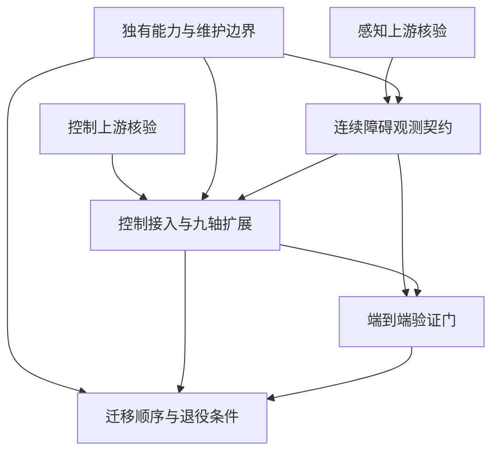

# 决策前沿（tracker 对齐视图）

2026-09-12 离线队列更新：当前可独立处理的工作已按用户要求拆为 OFF 票，执行前沿与推荐顺序见[离线执行说明](OFFLINE-EXECUTION-ORDER.md)。新票只依赖其他必要的离线成果，来源原票保留整体验收；原票与 OFF 票的对应见同文及 `OFFLINE-TICKETS.json`。下方早期决策视图不替代新执行队列。

本文件是仓库决策记录的查询视图；正式身份、领取、状态和阻塞以 GitHub 为准。2026-09-07 已将决策文档发布并同步地图 #1 与所有开放原票。仓库内五张复用/迁移决策已收敛；原 #16 已关闭，#17、#18 仍因具体目标、数值和证据保持开放，不能将“规划已收敛”解释为实施票已经完成。

| 决策票 | 类型 | 前置票 | 当前状态 |
|---|---|---|---|
| [核验 OSCBF 上游能否承接九轴控制与碰撞模型](issues/01-control-upstream.md) | research | 无 | 见票据状态与研究分支 |
| [核验双传感器感知与环境距离链的复用方案](issues/02-perception-upstream.md) | research | 无 | 见票据状态与研究分支 |
| [确定本项目独有能力与上游维护边界](issues/03-reuse-boundary.md) | grilling | 无 | 决议已发布 |
| [确定连续障碍观测契约与距离表示](issues/04-safety-observation.md) | grilling | 感知研究、独有能力边界 | 决议已发布；验证待实施 |
| [确定上游控制接入方式与九轴扩展边界](issues/05-control-adoption.md) | grilling | 控制研究、独有能力边界、观测契约 | 决议已发布；选型待实测 |
| [确定端到端验证门与故障处理边界](issues/06-validation-contract.md) | grilling | 观测契约、控制接入 | 决议已发布；数值证据待补 |
| [确定渐进迁移顺序与旧实现退役条件](issues/07-migration-order.md) | grilling | 独有能力边界、控制接入、验证门 | 决议已发布；退役待逐项验收 |

2026-09-12 续研：#18 的八项决策已确认，但新增核查表明 QP/admission 失败尚未接入控制器的锁存与最终命令网关；内核只对失败 tick 置零，后续仍经过低通。离线证据与剩余边界见[18 续研：QP 失败到最终命令的锁存与恢复链](research/18-recovery-command-chain-20260912.md)。该发现交给 #33 的实现/故障注入与 #17/#13/#34 的执行器证据，不解除 #18 的开放状态。

原有延迟、几何、可行性、冗余策略票继续作为证据前置，按 [原票据接续](REBASE.md) 引用，不重复创建。这里只列当前能够精确提问的决策；没有将所有可能实施工作预先拆票。
