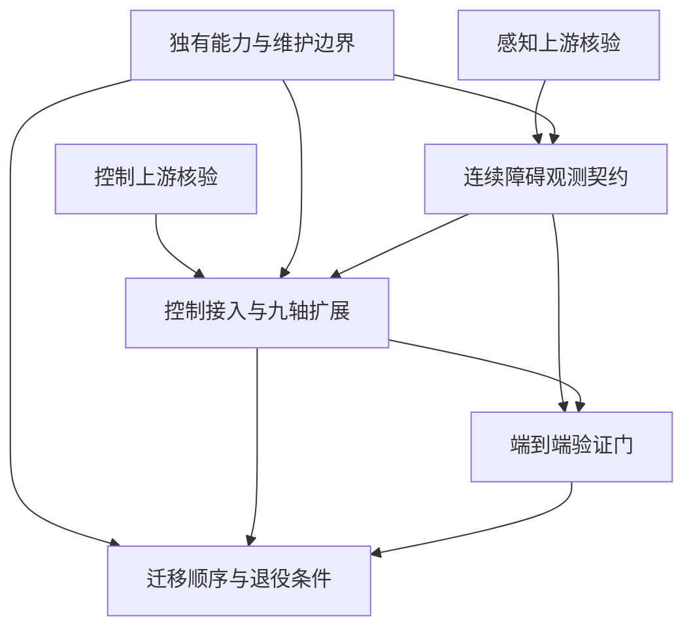

# 决策前沿（离线草案）

本文件是本地票据的查询视图；正式身份、领取和阻塞以发布后的 GitHub 为准。未恢复认证前不能协调远端并行领取。研究票已本地完成；独有能力边界与连续障碍观测经用户答复已本地解决，控制接入及端到端验证门也已本地解决，迁移顺序也已获用户接受；当前本地无 open 决策票。远端状态未变。

| 决策票 | 类型 | 前置票 | 当前状态 |
|---|---|---|---|
| [核验 OSCBF 上游能否承接九轴控制与碰撞模型](issues/01-control-upstream.md) | research | 无 | 见票据状态与研究分支 |
| [核验双传感器感知与环境距离链的复用方案](issues/02-perception-upstream.md) | research | 无 | 见票据状态与研究分支 |
| [确定本项目独有能力与上游维护边界](issues/03-reuse-boundary.md) | grilling | 无 | 本地已解决；待远端发布 |
| [确定连续障碍观测契约与距离表示](issues/04-safety-observation.md) | grilling | 感知研究、独有能力边界 | 本地已解决；待远端发布 |
| [确定上游控制接入方式与九轴扩展边界](issues/05-control-adoption.md) | grilling | 控制研究、独有能力边界、观测契约 | 本地已解决；待远端发布 |
| [确定端到端验证门与故障处理边界](issues/06-validation-contract.md) | grilling | 观测契约、控制接入 | 本地已解决；待远端发布 |
| [确定渐进迁移顺序与旧实现退役条件](issues/07-migration-order.md) | grilling | 独有能力边界、控制接入、验证门 | 本地已解决；待远端发布 |

原有延迟、几何、可行性、冗余策略票继续作为证据前置，按 [原票据接续](REBASE.md) 引用，不重复创建。这里只列当前能够精确提问的决策；没有将所有可能实施工作预先拆票。
