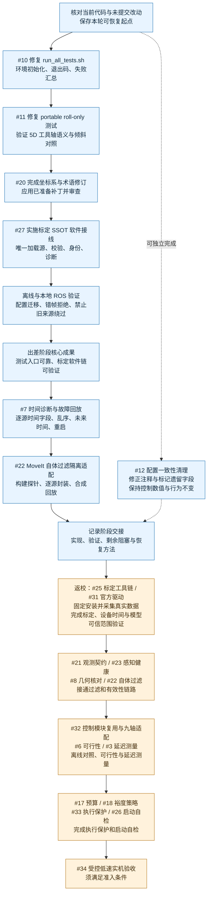

# 出差期间代码实施流程

更新：2026-09-11。依据当前本地交接与已核对的 tracker 状态。下列顺序是建议执行顺序；不替代各票的完整依赖与验收条件。



蓝色为出差期间推荐工作；橙色表示后续集成与验收路线，其中真实采集和实机试验需要设备。后续阶段中不依赖硬件的部分仍可提前推进。

## 每一步读取的本地交接

| 顺序 | 真实 ticket 号 | 工作 | 本地入口 | 当前可完成边界 |
|---|---|---|---|---|
| 1 | #10 | 测试入口修复 | [测试入口交接](handoffs/10-test-entrypoint.md) | 修复脚本并验证两套测试的退出码与失败汇总 |
| 2 | #11 | roll-only 测试修复 | [测试容差交接](handoffs/11-roll-only-tolerance.md) | 按既定 5D 语义修订测试并运行必要回归 |
| 3 | #20 | 坐标系与术语修订 | [术语交接](handoffs/20-spec-terminology.md) | 应用补丁、核对参数不变并完成审查 |
| 4 | #27 | 标定 SSOT 软件接线 | [标定 SSOT 交接](handoffs/27-calibration-ssot.md) | 加载、校验、配置迁移、身份与诊断；真实标定精度另验 |
| 5 | #7 | 时间诊断与回放 | [时间模型交接](handoffs/7-perception-time-model.md) | 只读记录器、离线校验、合成时间故障；最终有效期不定案 |
| 6 | #22 | 自体过滤隔离适配 | [自体过滤交接](handoffs/22-self-filter.md) | 上游构建探针、版本化输入输出、回放；正式接线仍有前置 |
| 独立 | #12 | 配置一致性清理 | [配置清理交接](handoffs/12-config-consistency.md) | 行为不变的标注与注释修正；不修改 alpha、控制周期 |

## 执行与完成规则

一次实施一张 ticket。每次先核对已有未提交工作和交接起点，完成该票范围内的改动与必要验证，再更新对应交接。只完成离线部分的票保留开放，写明剩余设备或集成证据。

标定 SSOT 可以使用构造数据验证软件契约；假定外参继续标记未标定，不将文件身份一致视为精度通过。时间诊断与过滤适配不得自行引入最终安全阈值。

本次出差优先完成前四步：测试入口、roll-only 测试、术语修订、标定 SSOT 软件接线。时间诊断与自体过滤作为后续扩展。

## Wayfinder 定位方式

正式 tracker 仓库：`Shiningliu1011/nineaxis_safecontrol`；正式地图为 **#1 OSCBF Wayfinder Map — 9DOF LiDAR+depth OSCBF 复用与迁移地图**。上表及图中的 `#数字` 都是该仓库真实 GitHub issue 号，不是执行顺序号，也不是标题中的历史编号（如 T7、03、04）。本地文件用于交接，领取和最新依赖仍读取正式 tracker。

注意：`handoffs/32-targetless-calibration-trial.md` 是无板标定试验记录，归属 **#25 标定工具链** 的相关工作；文件名前缀 32 **不是**该工作的正式 ticket 号。真实 **#32 是「控制模块复用与九轴适配」**。

可复制到新窗口：

```text
使用 wayfinder，在 /home/lsn/robot/robot_safecontrol 处理
Shiningliu1011/nineaxis_safecontrol 的 #10「run_all_tests.sh 在 set -euo pipefail 下直接退出」。
正式地图是该仓库的 #1。
先读取 docs/planning/oscbf-reuse/TRAVEL-EXECUTION-FLOW.md 和
handoffs/10-test-entrypoint.md（相对于同一规划目录），核对远端正文、评论、依赖和已有认领。
本窗口按该票已确认范围实施代码修改，完成必要验证并更新交接。
保留已有未提交工作；不启动实机，不自动处理下一张票。
```

后续窗口将 ticket 号、名称及对应交接文件替换为上表中的下一项。
