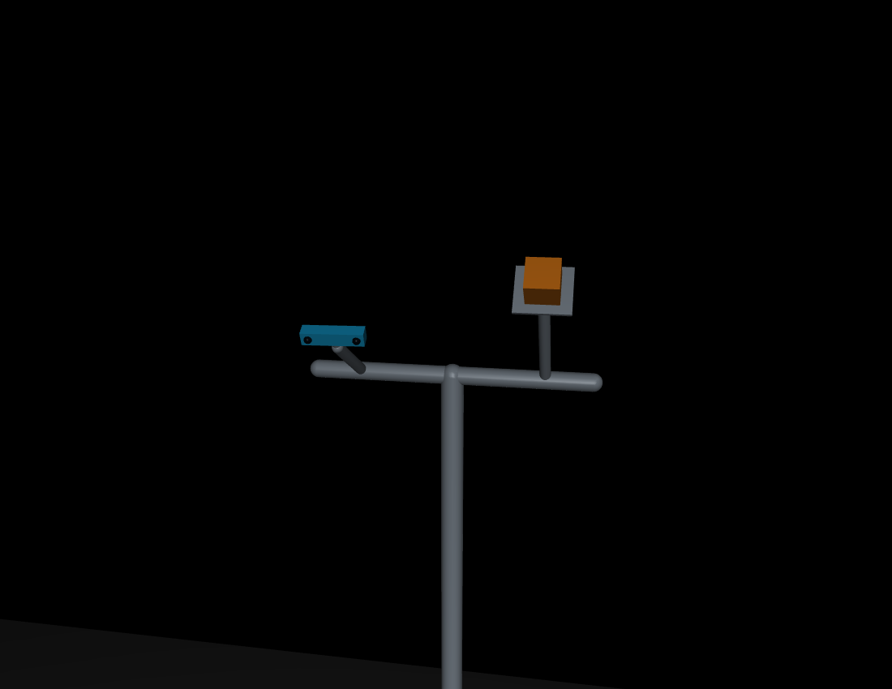
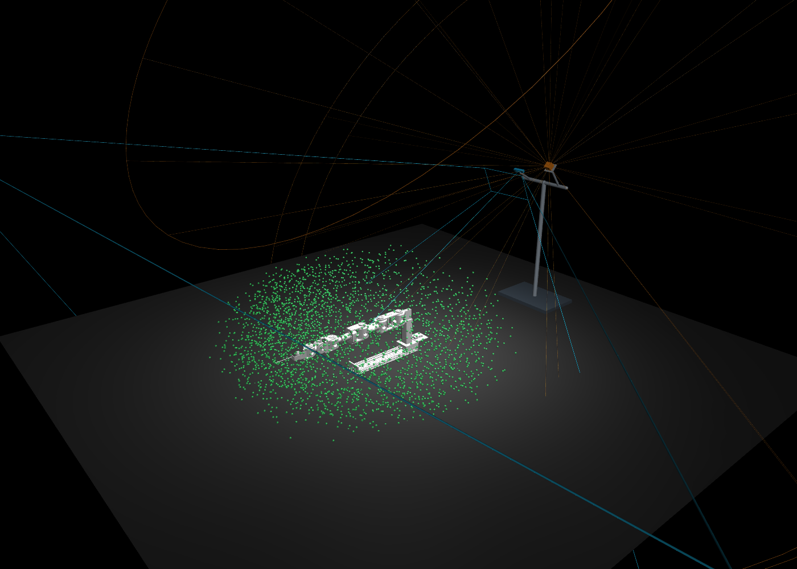

# 双传感器共用支架布局、布线与联合标定

定案日期：2026-09-11。用户确认采用本对话最终的「基座后上方、同一支架、分别调角」布局。

**已选定的是布局方案和安装初始值；尚未完成实物安装、外参标定或安全验收。** 本文汇总对话中的设备研究、MuJoCo 预览、方案取舍与落地步骤。后续以本文件作为安装方案入口，对侧分置的旧研究保留为历史依据。

## 1. 决定与理由

Gemini 335L 深度相机与 Livox MID-360S 固定在同一臂外支架：单立柱、横梁、两个独立安装座；相机位于左下，雷达位于右上，各自朝向工作区。支架不随任何关节运动。

选择该方案的原因：

- 避免把雷达放在机械臂可能扫过的近旁，安装结构集中在基座后方。
- 用户已确认使用官方线缆；把两个设备放近，便于连接同一笔记本，优先避免长 USB 延长链。
- 相近视点更容易观察同一标定靶的正面，且共架固定有利于保持相对外参稳定。
- 两个安装座分别调角，匹配相机视锥与雷达非对称的垂直扫描范围。

代价是两个视点更相近，可能同时被同一连杆或工件挡住；共架也可能一起振动。几何覆盖结果不能代替遮挡、结构稳定性和实际检测验收。

决策摘要见 [ADR 0007](adr/0007-shared-rear-sensor-stand.md)。

## 2. 坐标与选定布局

所有下表坐标使用机械臂 **base_link**，单位米：+Y 向上、+Z 沿 J1 直线导轨、+X 横向。本方案将「后方」明确为 **−Z**；左右以 X 的正负表达，不以屏幕视角判断。base_link 固定，J1 的移动包含在机械臂运动学中。MuJoCo 的 Y-up→Z-up 旋转仅用于显示，不应再次写入实机外参。[坐标约定](../CONTEXT.md)

| 项目 | 选定初始值 | 含义 |
|---|---|---|
| 相机中心 | `(-0.20, 1.48, -1.90)` | 横梁左侧较低位置 |
| 相机观察目标 | `(0, 0.30, 0.50)` | 光轴指向此点；向下俯视约 26° |
| 雷达中心 | `(0.20, 1.60, -1.90)` | 横梁右侧较高位置 |
| 雷达倾斜 | 正立起向 +Z 倾斜 50° | 其上方向从 +Y 转向 +Z；不是相机光轴俯角 |
| 两设备间距 | 水平 0.40 m、高差 0.12 m | 中心直线距离约 0.418 m |
| 支架立柱 | `X=0, Z=-2.10` | 在传感器后方 |
| 横梁 | 高 1.35 m、总宽 0.60 m | 通过独立连接座连接两个传感器 |

中心坐标是简化模型的参考位置，不是安装孔、镜头光心或接插件的实测位置；施工需根据厂商机械图换算。底板、立柱、连接座、雷达散热板均为示意，尚未给出可加工图、刚度计算、紧固件或锚固设计。

- [当前可调预览配置](../config/sensor_placement_preview.json)
- [选定时的配置快照](assets/sensor-layout/selected-layout-2026-09-11.json)：保留本次决策数值，避免后续调试覆盖历史。





## 3. 官方参数与预览参数的边界

| 设备 | 官方事实 | 当前几何模型 |
|---|---|---|
| Gemini 335L | 标称深度视场约 90°×65°；理想距离 0.25～6 m | 对称针孔视锥，深度轴范围 0.25～6 m |
| MID-360S | 水平 360°、垂直 −7°～52°；0.1 m 近盲区；40 m 是指定反射率条件下典型值 | 将扫描角带按安装姿态旋转，距离范围暂用 0.2～40 m |

依据：[Orbbec USB 系列官方规格书 V1.7](https://orbbec-debian-repos-aws.s3.amazonaws.com/product/Gemini%20330%20series%20Datasheet-V1.7.pdf)、[Livox 官方规格](https://www.livoxtech.com/mid-360s/specs)。雷达 0.1～0.2 m 精度不保证，0.1～1 m 内细小或低反射目标检测也有限制，不能把模型中的距离区间解释为全区可靠检测。

当前视野线显示到相机 **4.06 m**（光轴深度）和雷达 **4.14 m**（径向），只为画出工作区周围的形状，不是厂商最大量程。此前 2 m/2.6 m 的短示意线造成部分点「未覆盖」的视觉误导，后续已经将显示长度与几何评估范围分开。

实机最终必须读取实际分辨率、内参、畸变与点云 frame。项目曾配置 640×480 和深度对齐彩色图像，不能直接认定输出点云具有完整的 90°×65°有效视场。还未模拟：深度无效区、遮挡、反射率、雷达扫描累积时间、角度相关有效量程、点密度与动态检测延迟。[Orbbec 规格书 §§4.5–4.7](https://orbbec-debian-repos-aws.s3.amazonaws.com/product/Gemini%20330%20series%20Datasheet-V1.7.pdf)、[MID-360S 手册 §2](https://terra-1-g.djicdn.com/65c028cd298f4669a7f0e40e50ba1131/Mid-360S/UM/20260601/Livox_Mid-360s_User_Manual_en.pdf)

## 4. MuJoCo 已完成的验证

机械臂来自仓库 ninezzhou URDF 和 STL。对 J1～J9 的关节限位进行 8,192 组固定种子的 Sobol 采样，附加零位、全部关节下限和全部关节上限，共 **8,195 组姿态**；通过正运动学取得 tool0 位置。绿色点不是实机传感器点云，而是末端位置样本。

最终共用支架布局的名义视场判断：

| 分类 | 姿态样本数 |
|---|---:|
| 同时进入两传感器视场 | 8,194 |
| 只进入相机视场 | 1 |
| 只进入雷达视场 | 0 |
| 两者都未覆盖 | 0 |

这是**关节姿态样本计数，不是工作空间体积覆盖率，也不是无盲区证明**。未排除自碰撞、地面/环境碰撞，未约束工具朝向，未包含额外工具或所持工件。部分点在地面以下；不能将它们解释为可执行作业点。画面经过体素抽样，最多显示 3,000 点。

紫色线框是连杆网格若干表面极值点随采样姿态运动后的凸包，既可能填入不能到达的区域，也不能保证包住未采样姿态的全部几何。它不是完整、经证明的连杆扫掠体积。

采样的 base_link 边界约为 `X[-1.323,1.327]、Y[-0.231,0.912]、Z[-0.933,1.836] m`，仅对应末端样本。点云 ROI 裁剪参数不能当成机械臂工作空间。最终支架与机器人、工具、工件的碰撞间隙仍需单独验证。

证据：[计算记录及源文件哈希](assets/sensor-layout/geometric-check-2026-09-11.json)、[预览脚本](../scripts/preview_sensor_placement.py)、[视场判断](../scripts/sensor_placement_geometry.py)。对侧布局曾做的 32,768 组独立采样不属于本最终布局的验证结果。

在仓库根目录运行（仅显示，不发送机械臂硬件命令）：

```bash
source /opt/ros/humble/setup.bash
python3 scripts/preview_sensor_placement.py
```

可选 `--config docs/assets/sensor-layout/selected-layout-2026-09-11.json` 复现选定参数；使用 `--render output/shared-stand.png` 导出整景。C/L 切换相机/雷达视场，W 切换工作空间点，B 切换紫色连杆凸包；关节滑条用于观察不同姿态。点颜色：绿=两者、蓝=仅相机、橙=仅雷达、红=均未覆盖。旧方案只用于比较，不再作为当前安装方案。

## 5. 官方线缆与同一笔记本

用户已确认两设备均使用官方线。官方资料列相机标准 USB 3 线为 1 m、MID-360S 配套分线器为 1.5 m；现场仍应核对具体附件版本与实际可用长度。

优先将笔记本放在支架后方的相邻固定台面，保持 USB 短线；两根信号线沿各自安装座汇到立柱后侧，避免拉扯设备、挡住窗口或穿过机械臂运动区域。笔记本台面位置尚未确定，传感器相距 0.418 m 不等于官方线一定能到电脑；下引、转弯、余量必须实量。不要默认笔记本放地面也能用 1 m 相机线。

```text
相机 ── 官方 USB 3 ───────── 同一笔记本
雷达 ── 型号匹配的分线器 ── RJ45 网口
                     └── 独立 DC 电源
```

- 相机需要 5 Gbps 数据能力和 5 V/1.5 A 或更高供电能力。官方实践建议 USB 线小于 3 m，但不是统一硬截止；长线/主动延长设备需实测数据和供电。[线缆设计](https://doc.orbbec.com/documentation/Orbbec%20Gemini%20330%20Series%20Documentation/Reference%20Design%20-%20Cable%20(USB)%20(Gemini%20330%20Series))、[供电设计](https://doc.orbbec.com/documentation/Orbbec%20Gemini%20330%20Series%20Documentation/Reference%20Design%20-%20Power%20Delivery%20(Gemini%20330%20Series))
- 雷达数据与供电分开。官方手册禁止向其 RJ45 连接 PoE 设备。DC 范围 9～27 V、推荐 12 V；典型 6.5 W 不等于启动要求，0～35°C 启动约 18 W/8 秒，低温自加热可达 14 W。线缆弯曲半径至少 60 mm；安装散热与支架结构按手册检查。[手册 §§1.2、3、4.1](https://terra-1-g.djicdn.com/65c028cd298f4669a7f0e40e50ba1131/Mid-360S/UM/20260601/Livox_Mid-360s_User_Manual_en.pdf)
- 若官方线仍不足，先调整电脑台面；必要时优先延长普通非 PoE 以太网数据段。主动 USB 延长属于后备，不是已确认采购项。
- 对话中只读检查曾发现相机与 USB 网卡共用 5 Gbps USB hub；不能由此认定供电或带宽不足。若可用，优先雷达接独立网口，最终以两路同时采集的稳定性验收。

## 6. 共架布局的联合标定路线

共架缩短基线、改善共同正面观测条件，但不免除外参标定。安装与走线完成并锁紧后，再开展以下步骤；标定中固定传感器，仅改变靶标或末端姿态。

1. **确认相机模式与帧。** 保存对应图像的内参/畸变、CameraInfo、原始数据、实际 optical frame、雷达 frame 和时间戳。RGB 标定结果与原始 depth frame 不能混用。
2. **确认共同特征可见。** 用多个位置、距离和倾角检查完整靶标特征；还需确认同一支架、散热板、相机外壳不会遮住雷达所需的射线。
3. **求雷达—相机外参。** 能看清规范反光环板时，优先验证作者版 FAST-Calib2 的中心提取与多场景标定。它使用四反光环和四视觉标记，作者多场景流程至少三组；其 Mid360 示例不等于本机 MID-360S 已验证。ROS 1 工具与本项目 ROS 2 数据仍需离线适配。[作者仓库](https://github.com/xuankuzcr/FAST-Calib2)
4. **无板后备。** 有共同可见自然结构、真实 2D–3D 对应和可用强度纹理时，可用 Koide 手动初始化＋自动精化。Livox 静态录制 10～15 秒/组，作者建议 5～10 组。不同表面不能强行对应。[作者采集要求](https://koide3.github.io/direct_visual_lidar_calibration/collection/)
5. **求相机—基座外参。** 固定相机观测末端轻型刚性视觉板，结合全九轴 FK 的多位置、多轴转动静态姿态求 AX=YB；沿用已有方向核验的适配方案。板安装偏移未知时必须一并求解，不能把板原点当成 tool0。[项目标定工具链研究](planning/oscbf-reuse/research/calibration-toolchain.md)
6. **独立验收。** 用未参与求解的靶标位置和姿态检查两路到基座的位置误差、互标误差和重复性。若共同特征不足，才退回分别标定到可信基准或已知几何多面靶体，不假定共架必然标定成功。

约定 `A_T_B` 把 B 系坐标映射到 A 系，B=base_link、C=所选相机 optical frame、L=雷达 frame：

```text
B_T_L = B_T_C · C_T_L
C_T_L = inverse(B_T_C) · B_T_L  # 若两源分别对基座标定
```

工具输出方向必须核对：Koide 的 `T_lidar_camera` 表示相机到雷达，需要按目标方向取逆；不能凭变量名填写。[输出定义](https://koide3.github.io/direct_visual_lidar_calibration/programs/)

只有通过验收的结果才写入项目标定真源，携带来源、时间、设备身份、误差与坐标方向；部署后核对实际加载记录。[ADR 0004](adr/0004-calibration-ssot-sensor-extrinsics-authority.md)。布局 JSON 和本文快照不是实机外参，不应直接复制为已标定矩阵。

同一笔记本不代表硬件采样同步。静态空间标定之外，还要检查动态时间偏移、帧龄、丢帧和端到端延迟。若整体移动刚性支架且内部关系未变，雷达—相机关系理论上可保持，但到基座外参需更新并验证；单独调整安装座后更新受影响的外参。

## 7. 安装落地与待验证事项

| 顺序 | 要完成的工作 | 当前状态 |
|---|---|---|
| 1 | 采用后上方共架方案 | 用户已确认 |
| 2 | 依据现场尺寸、工具/工件、紧固与散热要求设计支架；检查底板、立柱、安装座碰撞范围 | 待设计/测量；现有为概念模型 |
| 3 | 确定电脑台面、供电和官方线实际路径，固定并消除线缆拉力 | 待现场确认 |
| 4 | 读取最终相机模式和有效视场，检查实际点云质量 | 待实测 |
| 5 | 覆盖导轨两端、伸展/折叠姿态和工件遮挡，检查共同盲区 | 待仿真/实测 |
| 6 | 完成双传感器及机器人基座外参标定、独立目标验收 | 未标定 |
| 7 | 同时开流测试稳定性、时间对齐及动态障碍物检测 | 待实测 |

先完成以上验证，再按实际观测覆盖确定可用作业区域和运动条件。布局接受与实机性能验收分别记录。

## 8. 方案演变与历史资料

- 初始低位近旁雷达：用户指出可能被机械臂碰到，弃用该位置。
- 两侧分置、约 4.18 m 基线：改善视点互补，但官方短线难接同一电脑，共同标定表面可能接近侧视；不再作为选定方案。
- 后上方两个独立立杆：确认倾斜后的名义视场几何可行，但未满足共架安装诉求。
- **最终后上方共架**：采用本文件第 2 节参数；接受共同遮挡需进一步验证的代价，换取集中布线、相对安装稳定和更便利的共同靶标观察。

历史资料：[对侧布局标定与布线研究](planning/oscbf-reuse/research/sensor-placement-calibration-and-cabling.md)、[无板标定研究](planning/oscbf-reuse/research/targetless-lidar-camera-calibration.md)、[标定工具链研究](planning/oscbf-reuse/research/calibration-toolchain.md)。历史研究中的推荐受当时摆放约束，不应覆盖本次布局决策。
